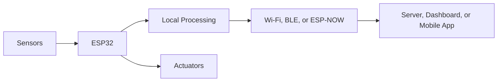
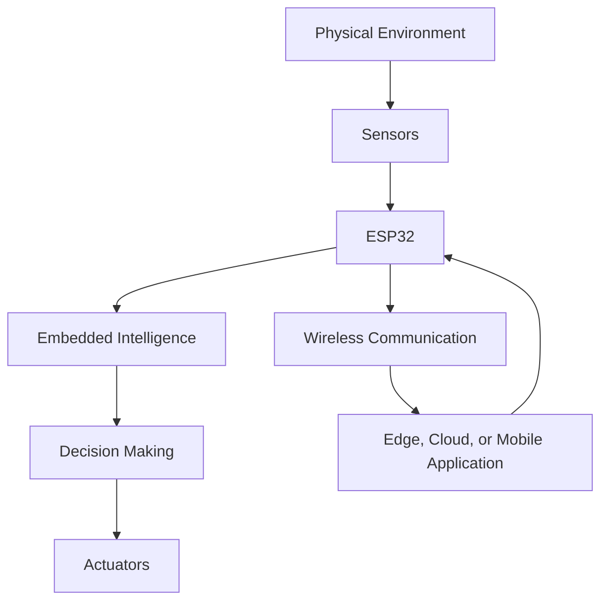

# ESP32 MCU

[ESP32.net](http://esp32.net/) is an independent information portal focused on the **ESP32 family of microcontrollers** and their applications in the Internet of Things. It introduces the ESP32 as a low-cost, low-power system-on-chip incorporating Wi-Fi and Bluetooth connectivity.

## What Is the ESP32?

ESP32 is a microcontroller family developed by Espressif Systems. Depending on the specific model, an ESP32 device can integrate:

- A 32-bit processor
- Wi-Fi connectivity
- Bluetooth or Bluetooth Low Energy
- General-purpose input/output pins
- Analog-to-digital and digital-to-analog converters
- Pulse-width modulation
- UART, I²C, SPI, and I²S interfaces
- Touch sensing
- Timers and low-power operating modes

These capabilities allow an ESP32 to read sensors, process data, control actuators, and communicate with other devices or Internet services.

## Information 

The part acts mainly as a directory and reference collection for the ESP32 ecosystem. Its resources include:

- ESP32 chips, modules, and development boards
- Board photographs and pinout diagrams
- Datasheets and technical documentation
- USB-to-UART bridge information and drivers
- Development tools and programming frameworks
- Community projects and tutorials
- News about ESP32 hardware and software
- Historical information about older ESP32 and ESP31B products

The website also maintains a separate historical section for obsolete boards and early ESP32-related information.

- [ESP32.net Main Website](http://esp32.net/)
- [Historical ESP32 Information](http://esp32.net/historical/)
- [USB-to-UART Bridge Information](http://esp32.net/usb-uart/)

## ESP32 Development Workflow

A basic ESP32-based system operates as follows:

Developers can program ESP32 boards using:

- Arduino IDE
- PlatformIO
- ESP-IDF
- MicroPython
- CircuitPython, where supported

## Applications

ESP32 boards are commonly used for:

- Environmental monitoring
- Smart-home automation
- Wearable devices
- Robotics
- Industrial monitoring
- Wireless sensor networks
- MQTT and HTTP communication
- Local web servers and dashboards
- TinyML and edge-AI applications
- ESP-NOW device-to-device communication

## Relationship to Intelligent Object Engineering

ESP32 is an appropriate platform for **Intelligent Object Engineering** because it combines the principal components required by an intelligent object:

$$
\text{Intelligent Object}
=
\text{Sensing}
+
\text{Embedded Processing}
+
\text{Communication}
+
\text{Actuation}
$$

For example, an ESP32 wearable device can collect movement data from an MPU6050 sensor, classify activities locally using TinyML, and transmit the results to a smartphone through Bluetooth Low Energy.

## Example Intelligent Object Architecture

## Important Limitation

ESP32.net should be treated as a convenient community reference and discovery portal, particularly for board identification and historical material.

For current specifications, security advisories, software releases, and production development, information should be verified using the official [Espressif Documentation](https://docs.espressif.com/).

## References

1. ESP32.net, “The Internet of Things with ESP32.” Available: [http://esp32.net/](https://esp32.net/)
2. ESP32.net, “Historical ESP32 Information.” Available: [http://esp32.net/historical/](https://esp32.net/historical/)
3. ESP32.net, “USB-to-UART Bridge Chips.” Available: [http://esp32.net/usb-uart/](https://esp32.net/usb-uart/)
4. Espressif Systems, “ESP32 Documentation.” Available: [http://docs.espressif.com/](https://docs.espressif.com/)
