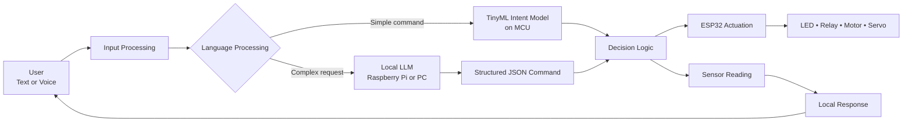
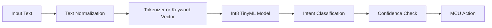
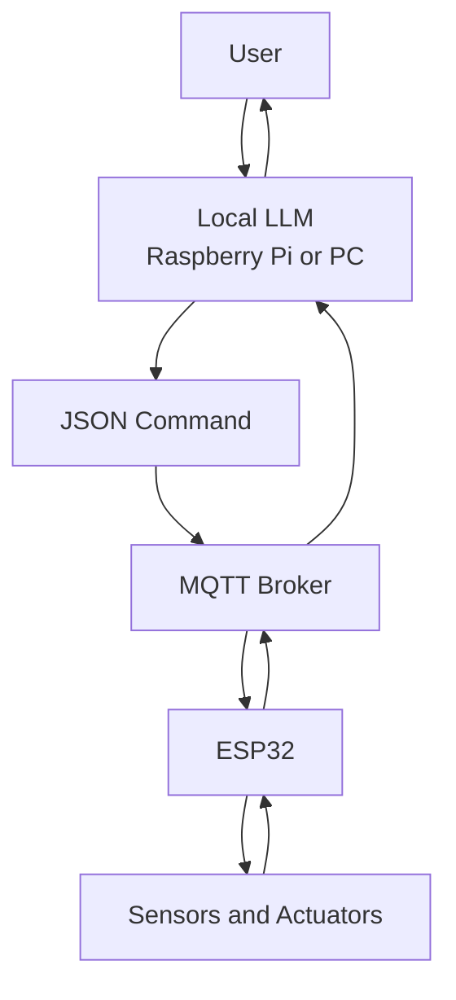

# Local LLM for MCU

A **Local LLM for MCU** is a language-processing system that operates locally on or near a microcontroller without depending entirely on cloud services. However, conventional large language models such as Llama cannot normally run directly on an ESP32 because of limited RAM, Flash memory, and processing power.

For ESP32-class devices, the practical solution is either:

1. A **Tiny Language Model** running directly on the MCU
2. A **Hybrid Local LLM** in which the MCU communicates with a local edge computer

## Recommended Architecture



## Option 1: Tiny Language Model on ESP32

This method runs completely offline on the MCU. It does not generate unrestricted text; instead, it classifies user commands into predefined intentions.

### Example Intents

```text
LIGHT_ON
LIGHT_OFF
FAN_ON
FAN_OFF
READ_TEMPERATURE
READ_HUMIDITY
UNKNOWN
```

Example:

```text
Input: "Please switch on the light."
Output: LIGHT_ON
```

### Processing Pipeline



### Training Data

```csv
text,label
turn on the light,LIGHT_ON
switch the lamp on,LIGHT_ON
turn off the light,LIGHT_OFF
start the fan,FAN_ON
stop the fan,FAN_OFF
read the temperature,READ_TEMPERATURE
what is the humidity,READ_HUMIDITY
```

### Lightweight Model

```python
import tensorflow as tf

model = tf.keras.Sequential([
    tf.keras.layers.Input(shape=(VOCAB_SIZE,)),
    tf.keras.layers.Dense(16, activation="relu"),
    tf.keras.layers.Dense(8, activation="relu"),
    tf.keras.layers.Dense(NUM_CLASSES, activation="softmax")
])

model.compile(
    optimizer="adam",
    loss="sparse_categorical_crossentropy",
    metrics=["accuracy"]
)

model.fit(x_train, y_train, epochs=100)
```

After training, convert the model to an Int8 TensorFlow Lite model:

```python
converter = tf.lite.TFLiteConverter.from_keras_model(model)
converter.optimizations = [tf.lite.Optimize.DEFAULT]

def representative_dataset():
    for sample in x_train[:100]:
        yield [sample.reshape(1, -1).astype("float32")]

converter.representative_dataset = representative_dataset
converter.target_spec.supported_ops = [
    tf.lite.OpsSet.TFLITE_BUILTINS_INT8
]
converter.inference_input_type = tf.int8
converter.inference_output_type = tf.int8

tflite_model = converter.convert()

with open("intent_model.tflite", "wb") as file:
    file.write(tflite_model)
```

Convert the model into a C array:

```bash
xxd -i intent_model.tflite > intent_model.h
```

The resulting header file can be included in ESP32 firmware and executed using TensorFlow Lite for Microcontrollers.

## Option 2: Hybrid Local LLM

A hybrid architecture is recommended when the system must understand flexible natural-language instructions or generate responses.



The LLM runs locally on:

- Raspberry Pi
- Mini PC
- Laptop
- Local server
- NVIDIA Jetson

The ESP32 performs:

- Sensor acquisition
- Real-time control
- Actuator operation
- MQTT or HTTP communication
- Safety checking
- Local fallback control

### Example Command Generated by the LLM

```json
{
  "device": "fan",
  "action": "turn_on",
  "duration_seconds": 300
}
```

The ESP32 verifies the command before executing it:

```cpp
if (
    device == "fan" &&
    action == "turn_on" &&
    durationSeconds <= 600
) {
    digitalWrite(FAN_PIN, HIGH);
}
```

## Comparison

| Feature | Tiny model on MCU | Hybrid local LLM |
|---|---:|---:|
| Runs completely on ESP32 | Yes | No |
| Internet required | No | No |
| Natural-language flexibility | Low | High |
| Generative responses | Very limited | Yes |
| Memory requirement | Low | High on edge computer |
| Real-time device control | Excellent | Requires communication |
| Safety and determinism | High | Requires command validation |
| Recommended use | Fixed commands | Intelligent assistant |

## Recommended ESP32 Implementation

For an intelligent connected-object laboratory, use:

- ESP32-S3 with PSRAM
- TinyML intent classifier
- MQTT communication
- Temperature or environmental sensor
- LED, relay, servo, or fan
- Raspberry Pi or PC for the optional local LLM
- JSON-based commands
- ESP32 safety and authorization rules

## Key Principle

The LLM should not directly manipulate MCU hardware. It should generate a structured command, while deterministic ESP32 firmware validates and executes the action:

$$
\text{Natural language}
\rightarrow
\text{LLM interpretation}
\rightarrow
\text{validated command}
\rightarrow
\text{MCU control}
$$

For most ESP32 projects, the strongest design is therefore:

> **Local LLM for language understanding + ESP32 for safe real-time control.**
