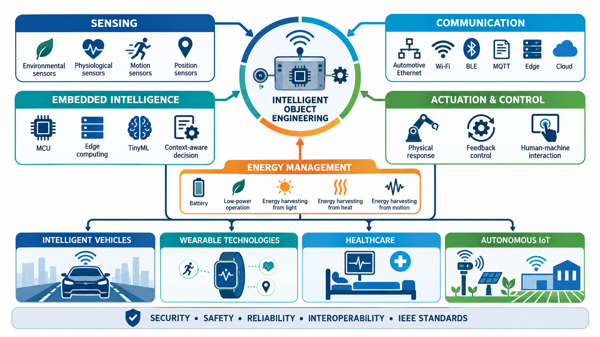

# Introduction: Intelligent Object Engineering

## Intelligent Object Engineering Framework

  

**Figure:** Conceptual framework of Intelligent Object Engineering, integrating sensing, embedded intelligence, communication, actuation and control, and energy management for intelligent vehicles, wearable technologies, healthcare systems, and autonomous IoT applications.

**Intelligent Object Engineering (IOE)** is an interdisciplinary field concerned with designing physical objects that integrate sensors, actuators, embedded computing, communication, artificial intelligence, and energy-management systems. Unlike conventional products with fixed functions, intelligent objects can perceive their environment, process data, communicate with other devices, and respond autonomously.

Modern vehicles are important examples of intelligent objects. Electric and connected vehicles integrate electronic control units, intelligent sensors, embedded software, and high-speed networks. Automotive Ethernet and Internet Protocol technologies support safety, security, Time-Sensitive Networking, service-oriented architectures, validation, and reliable communication among vehicle subsystems.

- [IEEE Automotive Technology Day](https://standards.ieee.org/events/automotive/)
- [Innovations Shaping the Future of Automotive Electronics](https://ieeexplore.ieee.org/document/10547141)

Wearable technologies—including smartwatches, fitness trackers, smart garments, electronic skin, and medical monitors—extend intelligent computing to the human body. These systems support healthcare, sports, safety, entertainment, and human–machine interaction.

- [Introduction to Wearable Technologies](https://blp.ieee.org/product/introduction-to-wearable-technologies/)
- [IEEE 360-2022: IEEE Standard for Wearable Consumer Electronic Devices](https://ieeexplore.ieee.org/document/9762855)

Energy efficiency is another essential requirement for intelligent objects. Energy-harvesting technologies can obtain power from light, body heat, sweat, motion, vibration, and radio waves, thereby reducing dependence on conventional batteries.

- [Energy Harvesting for Wearable Technology](https://spectrum.ieee.org/energy-harvesting-wearable-tech)

Therefore, IOE provides a unified framework for creating intelligent vehicles, wearable devices, healthcare systems, and autonomous IoT nodes that are context-aware, connected, energy-efficient, interoperable, secure, reliable, and capable of making meaningful decisions.

