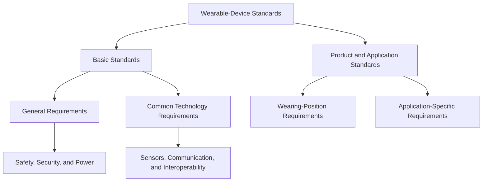

# Explanation of IEEE 360-2022

The uploaded document, **IEEE 360-2022**, is an IEEE standard titled:

> **IEEE Standard for Wearable Consumer Electronic Devices—Overview and Architecture**

It is not a conventional research article presenting experimental results. Instead, it establishes a common framework for classifying, designing, testing, and evaluating wearable consumer electronic devices.

## 1. Main Purpose

IEEE 360-2022 aims to help engineers and manufacturers develop wearable devices that are:

- Safe for continuous contact with the human body
- Secure against unauthorized access
- Reliable under practical operating conditions
- Compatible with wireless communication systems
- Suitable for their intended wearing positions
- Supported by appropriate testing procedures

The standard defines a **wearable device** as an electronic device worn directly on the body or through clothing or accessories. It can continuously sense and process information and interact with back-end computing systems to provide services.

## 2. Classification by Application

The standard identifies eight application categories:

| Category | Example functions |
|---|---|
| Activity and fitness | Motion, exercise, heart-rate, and activity monitoring |
| Environmental sensing | Temperature, humidity, gas, light, and air-quality monitoring |
| Medical | ECG, blood pressure, glucose, and respiratory monitoring |
| Health and lifestyle | Sleep, stress, diet, and general wellness monitoring |
| Tracking and positioning | GPS tracking for children, older adults, and pets |
| Infotainment | Voice interaction, gaming, Internet access, and smart control |
| Mobile payment | NFC- and barcode-based payments |
| Industrial | Exoskeletons, fatigue-monitoring glasses, and wearable computers |

A single device may belong to several categories. For example, a smartwatch can provide fitness tracking, health monitoring, GPS positioning, infotainment, and mobile payment.

> **Note:** Although medical and industrial wearables are included in the classification, devices intended specifically for medical and industrial applications are outside the main scope of this consumer-electronics standard.

## 3. Classification by Wearing Position

- **Hand-worn devices:** smartwatches, wristbands, rings, and smart gloves
- **Body-worn devices:** smart clothing, chest straps, belts, and limb-mounted devices
- **Head-worn devices:** smart glasses, headphones, helmets, and earrings
- **Foot-worn devices:** smart shoes, socks, and insoles

The wearing position affects sensor selection, measurement accuracy, communication performance, mechanical design, user comfort, and safety.

## 4. Wearable-Device Architecture

The standard organizes wearable-device specifications into two main levels:

### Basic Standards

Basic standards cover human safety, information security, power management, testing procedures, communication technologies, and interoperability.

### Product and Application Standards

These standards address particular products and use cases, such as smartwatches, activity trackers, location trackers, smart clothing, and head-mounted devices.

## 5. Major Technical Requirements

### 5.1 Human and Functional Safety

The standard covers electrical and battery safety, surface-temperature limits, radio-frequency exposure, specific absorption rate (SAR), child safety, and hardware and software functional safety.

### 5.2 Material and Environmental Safety

Requirements include limiting nickel release, restricting hazardous substances, evaluating coatings and surface materials, managing electronic waste, and considering environmental effects across the product lifecycle.

### 5.3 Information Security

Security is divided into five interconnected areas:

1. Wearable-device security
2. Smartphone or terminal-application security
3. Wireless-network security
4. Back-end and cloud-system security
5. User-data protection

The system should protect against eavesdropping, spoofing, data modification, unauthorized control, illegal access to personal information, untrusted software, and insecure updates.

### 5.4 Hardware Reliability

Wearable devices should be evaluated for water resistance, temperature endurance, corrosion, ultraviolet ageing, mechanical strength, drop resistance, and the durability of straps, buttons, switches, and connectors.

### 5.5 Wireless Communication and EMC

The document addresses Wi-Fi, Bluetooth, Bluetooth Low Energy, Near-Field Communication, electromagnetic emissions, immunity to interference, radio-frequency performance, and human exposure to electromagnetic fields.

### 5.6 Power Management

The standard covers rated battery capacity, low-temperature and high-rate discharge performance, battery transportation safety, and wireless charging using specifications such as **Qi** or **AirFuel**.

## 6. Relationship to Intelligent Object Engineering

IEEE 360-2022 supports **Intelligent Object Engineering** because it treats a wearable as an integrated intelligent system:

$$
\text{Intelligent Wearable}
=
\text{Sensors}
+
\text{Embedded Processing}
+
\text{Communication}
+
\text{Software}
+
\text{Cloud Services}
+
\text{Power Management}
+
\text{Human Interaction}
$$

Developing an intelligent object therefore requires the joint consideration of physical construction, sensing, embedded intelligence, wireless connectivity, cybersecurity, energy management, reliability, comfort, safety, and standards compliance.

## 7. Key Takeaway

The principal contribution of IEEE 360-2022 is a unified engineering architecture for wearable consumer electronic devices. A wearable must be evaluated as a complete cyber–physical system—from its body-contacting materials and embedded sensors to its mobile application, wireless network, cloud service, and protection of user data.

## Reference

IEEE Standards Association, *IEEE Standard for Wearable Consumer Electronic Devices—Overview and Architecture*, IEEE Std 360-2022, Apr. 2022.

Available: [IEEE Xplore](https://ieeexplore.ieee.org/document/9762855)
